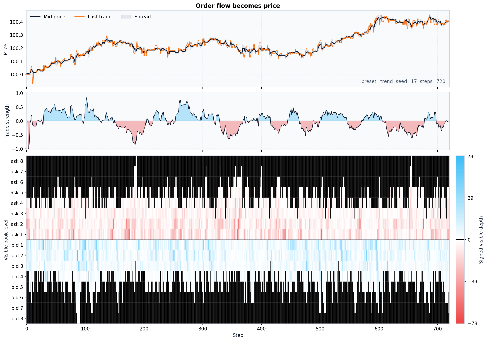
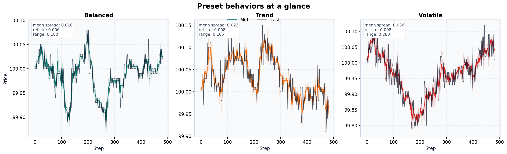
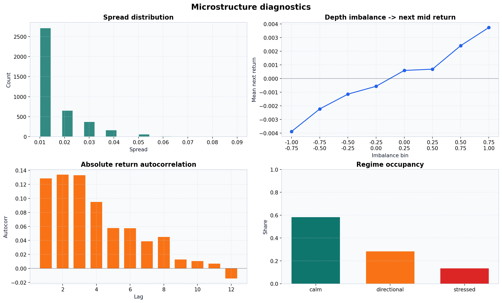

# orderwave Docs

[README](https://github.com/smturtle2/quoteflow/blob/main/README.md) | [한국어 문서](https://github.com/smturtle2/quoteflow/tree/main/docs/ko)

`orderwave` is a compact Python library for simulating a state-conditioned aggregate limit order book.

## Pages

- [Getting started](https://github.com/smturtle2/quoteflow/blob/main/docs/getting-started.md)
- [API reference](https://github.com/smturtle2/quoteflow/blob/main/docs/api.md)
- [Examples](https://github.com/smturtle2/quoteflow/blob/main/docs/examples.md)
- [Releasing](https://github.com/smturtle2/quoteflow/blob/main/docs/releasing.md)

## Core Idea

The simulator treats price as an outcome, not a primary sampled process.

- Limit orders are placed from state-conditioned level distributions
- Marketable flow reacts to book shape, hidden fair value, recent flow, and spread
- Cancellations can deplete the best quote
- Inside-spread improvement can tighten the market without a trade

This keeps the resulting path anchored to order-book mechanics rather than a direct random walk.

## Preview Gallery

