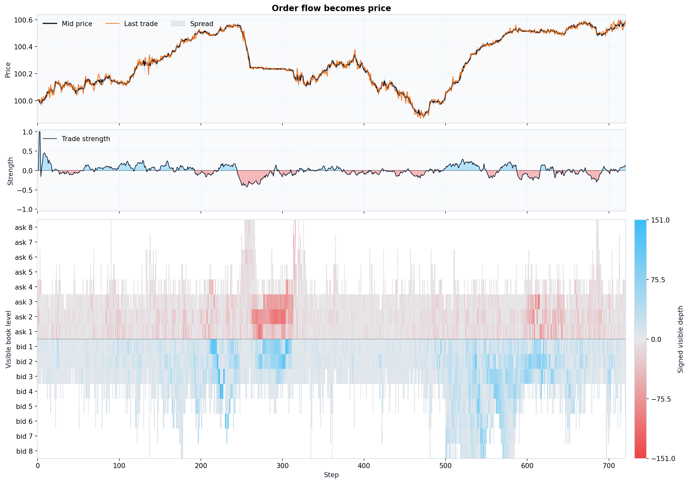
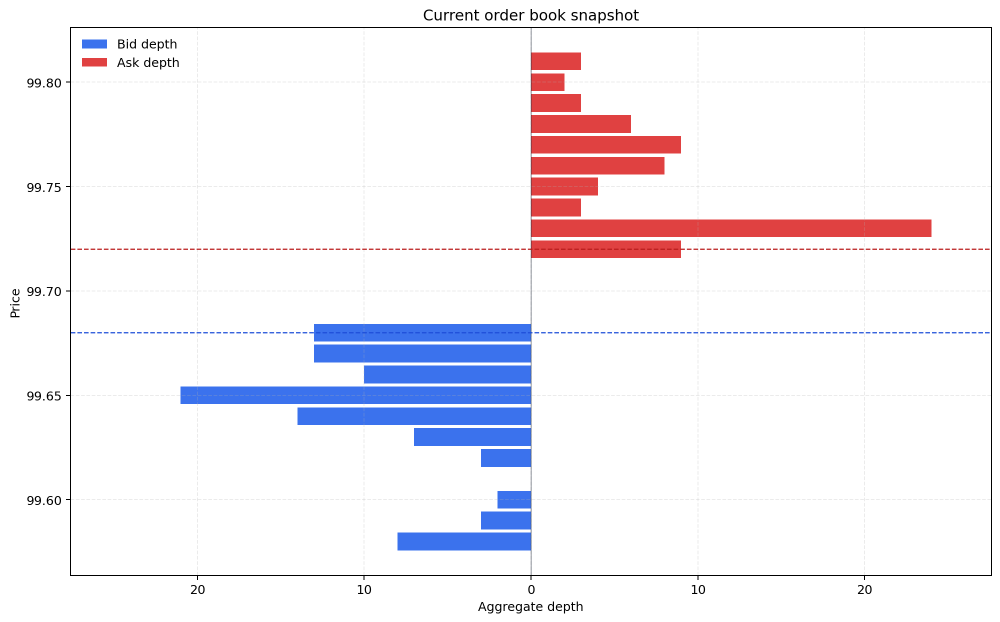
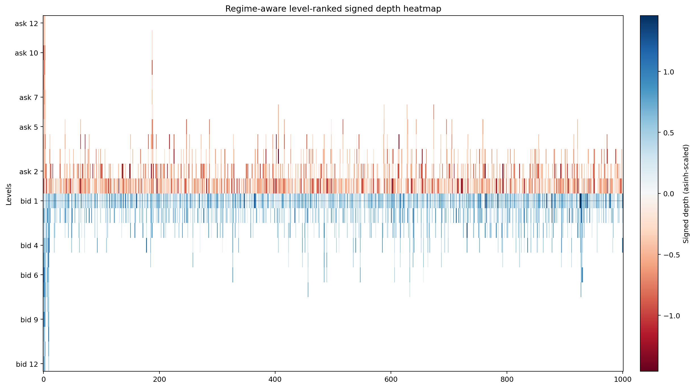
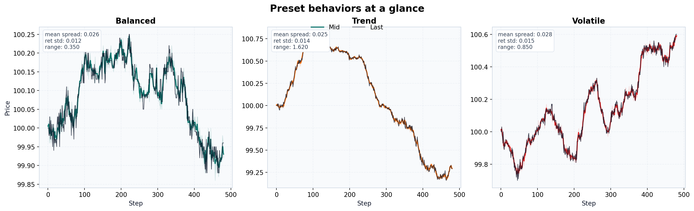

# Examples

[Docs index](https://github.com/smturtle2/quoteflow/blob/main/docs/en/README.md) | [한국어](https://github.com/smturtle2/quoteflow/blob/main/docs/ko/examples.md)

## Built-in Overview Plot

```python
from orderwave import Market

market = Market(seed=7, preset="trend")
result = market.run(steps=2_000)

labeled_events = market.get_labeled_event_history()
figure = market.plot(levels=8, title="orderwave overview")
figure.savefig("orderwave-overview.png")

print(result.snapshot)
print(labeled_events.tail())
```



## Current Book Snapshot

```python
book_figure = market.plot_book(levels=8, title="Current order book")
book_figure.savefig("orderwave-current-book.png")
```



## Diagnostics

```python
diagnostics = market.plot_diagnostics(max_lag=12, title="Diagnostics")
diagnostics.savefig("orderwave-diagnostics.png")
```



These built-in figures are meant to answer three different questions quickly:

- what path did the simulator generate?
- what does the current book look like?
- does the path have useful microstructure signals?

## Event Flow Inspection

```python
labeled_events = market.get_labeled_event_history()
market_fills = labeled_events.loc[labeled_events["event_type"] == "market", ["step", "side", "fill_qty", "fills"]]

print(market_fills.tail())
```

`get_labeled_event_history()` exposes the applied event stream together with aligned participant, meta-order, and shock labels. That removes the usual event/debug merge step from the common inspection flow.

## Latent Debug Inspection

```python
joined = market.get_labeled_event_history()

print(joined[["step", "event_idx", "event_type", "participant_type", "meta_order_id", "shock_state"]].tail())
```

`get_debug_history()` is still available when you want the raw aligned latent table, but the joined helper is the shorter default for exploratory analysis.

## Compact History-Only Runs

```python
fast_market = Market(seed=11, preset="balanced", logging_mode="history_only")
result = fast_market.run(steps=20_000)

summary = result.history
figure = fast_market.plot(title="Compact overview")
figure.savefig("orderwave-history-only.png")
```

`history_only` mode is the lighter option for long sweeps when you only need compact history, visible-book plotting, and trade strength. In this mode, `get_event_history()`, `get_debug_history()`, and `plot_diagnostics()` intentionally raise `RuntimeError`.

## CLI Example

The repository includes [`examples/plot_market_heatmap.py`](https://github.com/smturtle2/quoteflow/blob/main/examples/plot_market_heatmap.py), which calls `Market.plot()` directly.

```bash
python -m examples.plot_market_heatmap --steps 2000 --preset trend --output artifacts/orderwave_heatmap.png
```

## Performance Measurement

Use the single performance script when you want a quick throughput check, a floor check, and a `full` vs `history_only` comparison after engine changes.

```bash
python -m scripts.measure_performance --preset balanced --seeds 20 --steps 20000 --outdir artifacts/performance
```

The script writes:

- `performance_metrics.csv`
- `performance_summary.csv`
- `performance_logging_modes.csv`
- `performance_summary.md`

## Validation Sweep

Use the validation runner when you want the synthetic market-state validation pipeline rather than a single throughput snapshot.

```bash
python -m scripts.validate_orderwave --profile full --jobs 4 --outdir artifacts/validation
```

The runner writes:

- `validation_summary.md`
- `run_metrics.csv`
- `preset_summary.csv`
- `sensitivity_summary.csv`
- `invariant_failures.csv`
- `acceptance_decision.md`
- `diagnostics_<preset>_<seed>.png` when diagnostics rendering is enabled

Release builds run a dedicated `Release Validation` job that executes the shorter `--profile release` regression and compares it against `tests/golden/validation_release_baseline.json` before publish.
That release profile is intentionally tiny so the CI release gate stays fast.

The next engine improvement target is intentionally narrow: finer intra-step event feedback only.

## Preset Comparison



Preset comparison remains a docs-only figure generated from the same public simulation API with different presets.

## Regenerating Docs Images

```bash
python -m scripts.render_doc_images
```
