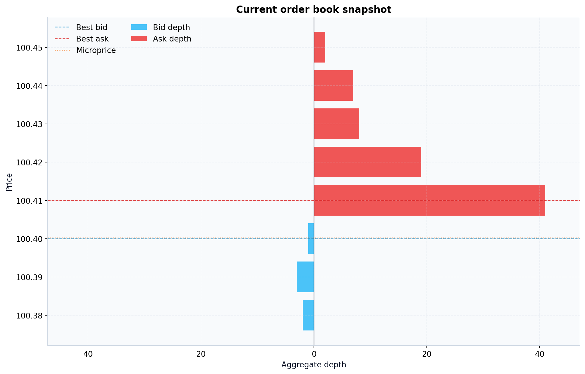

# Examples

[Docs index](https://github.com/smturtle2/quoteflow/blob/main/docs/README.md) | [한국어](https://github.com/smturtle2/quoteflow/blob/main/docs/ko/examples.md)

## Built-in Overview Plot

```python
from orderwave import Market

market = Market(seed=7, config={"preset": "trend"})
market.gen(steps=2_000)

figure = market.plot(levels=8, title="orderwave overview")
figure.savefig("orderwave-overview.png")
```


## Current Book Snapshot

```python
book_figure = market.plot_book(levels=8, title="Current order book")
book_figure.savefig("orderwave-current-book.png")
```



## Diagnostics

```python
diagnostics = market.plot_diagnostics(max_lag=12, title="Diagnostics")
diagnostics.savefig("orderwave-diagnostics.png")
```


These built-in figures are meant to answer three different questions quickly:

- what path did the simulator generate?
- what does the current book look like?
- does the path have useful microstructure signals?

## CLI Example

The repository includes [`examples/plot_market_heatmap.py`](https://github.com/smturtle2/quoteflow/blob/main/examples/plot_market_heatmap.py), which now calls `Market.plot()` directly.

```bash
python examples/plot_market_heatmap.py --steps 2000 --preset trend --output artifacts/orderwave_heatmap.png
```

## Preset Comparison


Preset comparison remains a docs-only figure generated from the same public simulation API with different presets.

## Regenerating Docs Images

```bash
python scripts/render_doc_images.py
```
